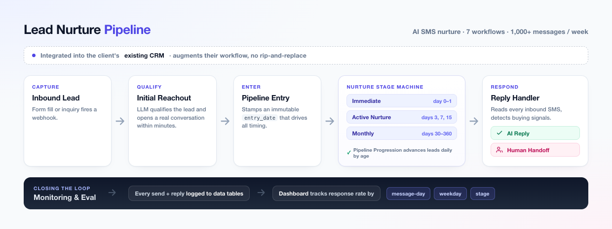
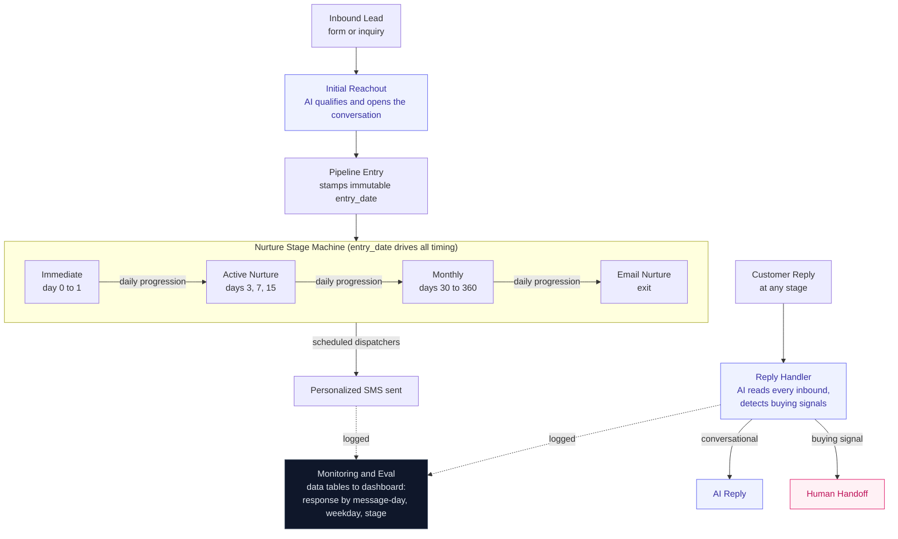

# Lead Nurture Pipeline

An AI-powered SMS lead-nurture system that automatically engages, qualifies, and follows up with inbound leads across a multi-stage pipeline, integrated directly into the client's existing CRM. Shipped to production for two detailing brands (auto and boat), sending more than 1,000 messages a week.

## The Problem

Detailing businesses live and die on speed-to-lead and persistent follow-up, but a small team cannot text every new inquiry within minutes, then again on day 3, 7, 15, 30, 60, and beyond. Leads go cold. The owners were leaving real revenue on the table because follow-up was manual, slow, and inconsistent.

## What It Does

- Engages every new lead within minutes of inquiry
- Generates personalized SMS with an LLM (real conversation, not canned templates)
- Moves leads through three time-based stages automatically: Immediate, Active Nurture, Monthly
- Detects buying signals in replies and hands off to a human rep at the right moment
- Plugs into the client's existing CRM, so it augments their workflow instead of replacing it

## Architecture

Seven coordinated workflows form a stage machine, with one immutable `entry_date` driving all timing.

| Workflow | Trigger | Role |
|----------|---------|------|
| Initial Reachout | New inquiry | AI qualifies the lead and opens the conversation |
| Pipeline Entry | Webhook | Stamps `entry_date`, checks contactability |
| Pipeline Progression | Daily | Advances leads between stages by age |
| Immediate / Active / Monthly Dispatchers | Scheduled | Send stage-appropriate touches |
| Reply Handler | Inbound SMS | AI reply, buying-signal detection, human handoff |

## The Monitoring and Eval Loop

The part I am proudest of: the system measures itself. Every send and reply is logged to data tables that feed a dashboard tracking response rate by message-day, by weekday, and by pipeline stage. I used that loop to tune prompts and timing during the ramp-up phase, and weekly response rates climbed from roughly 8% to a 29.5% peak as the system improved. Instrumenting what you ship is the difference between "it runs" and "it gets better."

## Results

| Metric | Value |
|--------|-------|
| Brands in production | 2 (auto and boat detailing) |
| Time in production | ~6 months |
| Throughput | 1,000+ SMS per week |
| Response rate (ramp-up) | increased from ~8% to a 29.5% weekly peak |

## Key Design Decisions

- **Single source of timing truth.** One immutable `entry_date` drives every scheduling decision, and nothing resets as leads move between stages.
- **Idempotent sends.** A `last_message_sent` guard prevents duplicate texts within a day.
- **Invisible routing.** Hidden markers in the LLM output (handoff, no-reply) drive routing without ever exposing system logic to the customer.
- **Respectful by default.** Business-hours enforcement and per-run rate limiting keep the system compliant and human-feeling.
- **CRM-native.** Integrated into the tooling the client already used, with no rip-and-replace.

## The Workflows

All seven workflows are included as importable JSON in [`workflows/`](workflows/), fully sanitized (search for `YOUR_` placeholders to adapt).

## License

[MIT](LICENSE)
